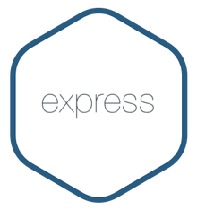

<h1 align ="center">📽 Reto  API TMDB 📽</h1>
<br>

Proyecto en grupo realizado para [Geeks Hubs](https://geekshubsacademy.com/) por [Alejandro](https://github.com/2020-JAUG) y [Juan Felipe](https://github.com/juanfegallego).

El reto consiste en el desarrollo de un backend para un videoclub.

 Para realizar este trabajo de forma colaborativa y hacer el reparto de tareas, hemos utilizado la herramienta <b>Trello.</b>

<b>Tiempo de inicio/fin: 19 - 29 de mayo de 2021.</b>

Para su desarrollo nos hemos basado en las buenas practicas que nos ofrece <b>GitFlow.</b>

Hemos utilizado <b>dos ramas de desarrollo</b> para trabajar nuestras funcionalidades de forma individual y después de validar cada endpoint, lo hemos subido a la rama <b>master.

</b> La tercera rama <b>feature</b> es en la que nos apoyabamos para realizar todas las pruebas necesarias. 

<br>


<br>
# ÍNDICE

- [¿Qué es? 🧐](#¿Qué-es?)
- [¿Cómo realizar una búsqueda?](#busqueda)
- [Requisitos ⚙️](#requisitos)
- [Seguridad 🔐](#seguridad)
- [Tecnologías](#tecnologías)

# <h1 align ="center"> ¿Qué es? 🧐 </h1>

Desde producción nos solicitan desarrollar un backend para un videoclub.  todos los datos de las peliculas se consultan mediante la <b>API</b> [The Movie Database](https://developers.themoviedb.org/3/getting-started/introduction) por medio de edpoints, los datos de los usuarios y de los pedidos se alojan en una base de datos interna alojada en local (<b>MySQLWorkbench</b>).<br>

Ejemplo de una búsqueda mediante <b>ID</b><br>

```JavaScript
router.get("/:id", async(req, res) => {
    try {
        let id = req.params.id;
        res.json(await moviesControllers.searchById(id));
    } catch (err) {
        return res.status(500).json ({
            mensaje: err.message
        });
    }
});
```
<br>
Ejemplo de la modificación de  <b>un pedido</b><br>
<br>


<h1 align ="center"> Requisitos ⚙️</h1>

- Tener instalado un editor de código para poder modificar cualquier archivo del proyecto.
- [Descargar](https://nodejs.org/es/) e Instalar <b>Node.</b>
```
    $ npm install node
```
- Instalar <b>Axios.</b>
```
    $ npm install axios
```
- Instalar <b>Express.</b>
```
    $ npm install express.
```
- Instalar [Postman](https://www.postman.com/downloads/)

- Instalar [MySQLWorkBench](https://www.mysql.com/products/workbench/)
# <h1 align ="center">¿Cómo realizar una búsqueda? 🔎</h1>
Para poder realizar una búsqueda se tiene que levantar el servidor local, en nuestro caso el <http://localhost:3000>.

- Abre la terminal y ejecuta el comando
```
    $ npm start
```
<br>
 
 cuando el servidor este levantado ya podemos trabajar en <b>Postman</b> y <b>MySQLWorkBench</b>
 <br>
[](https://app.getpostman.com/run-collection/525fc30c10583b80820d?action=collection%2Fimport)

<h2 align ="center"> Enlaces de búsquedas </h2>
<h3 align ="center"> Gestión de Usuario:</h3>
<br>

● Endpoint de Alta de usuario  POST( http://localhost:3000/users)
● Endpoint de Perfil GET( http://localhost:3000/users )
● Endpoint de Baja de usuario DELETE( http://localhost:3000/users/7 )
● Endpoint de Login de usuario POST(http://localhost:3000/login)
<br>
<h3 align ="center">Películas</h3>
<br>

● Película por título. (http://localhost:3000/movies/search/"Título de la pelicula")
● Película según su id. (http://localhost:3000/movies/"id de lapelicula ej: 35")
● Películas todas las peliculas (http://localhost:3000/movies/)
● Películas filtradas por géneros (indicando nombre, no id).
 (http://localhost:3000/movies/genre/"ej: Action")<br>
 <!-- <h3 align ="center">Series</h3> -->

<!-- ● Series top rated. (http://localhost:3000/series/)
● Series por id. (http://localhost:3000/series/"id de laserie")
● Series por título. (http://localhost:3000/series/search/"Título de la serie")
● Series que vayan a tener un capítulo emitido en los próximos 7 días. (http://localhost:3000/series/search/on_the_air)
● Series que vayan a tener un pase en teatros o cines. (http://localhost:3000/series/search/) -->

# <p align ="center">Seguridad 🔐</p>

Para el trabajo de la seguridad en nuestra aplicación requerimos la instalación de <b>jsonwebtoken</b> y <b>bcrypt</b>.
<br>
- Instalar <b>jsonwebtoken</b>
````
    $ npm install jsonwebtoken
````
- Instalar <b>bcrypt</b>

````
    $ npm install bcrypt
`````

Hemos generado distintos roles: <b>Admin</b> y <b>Cliente.</b>

Para asi poder diferenciar los permisos necesarios para el acceso a determinados endpoints. 

Ej: los Clientes no pueden ver todos los pedidos realizados por los demas usuarios, tampoco pueden obtener los todos los datos de los usuarios registrados en la BBDD.

El rol de <b>Admin</b> tiene pleno acceso.


# <p align ="center">Tecnologías 💻</p>
##### Para el desarrollo de este proyecto hemos trabajado con las siguientes tecnologías.<br>

 <a href="https://git-scm.com/" target="_blank">  <a href="https://developer.mozilla.org/en-US/docs/Web/JavaScript" target="_blank">  </a><a href="https://nodejs.org" target="_blank"> <a href="https://postman.com" target="_blank">    </a> </a> </a> </a>
